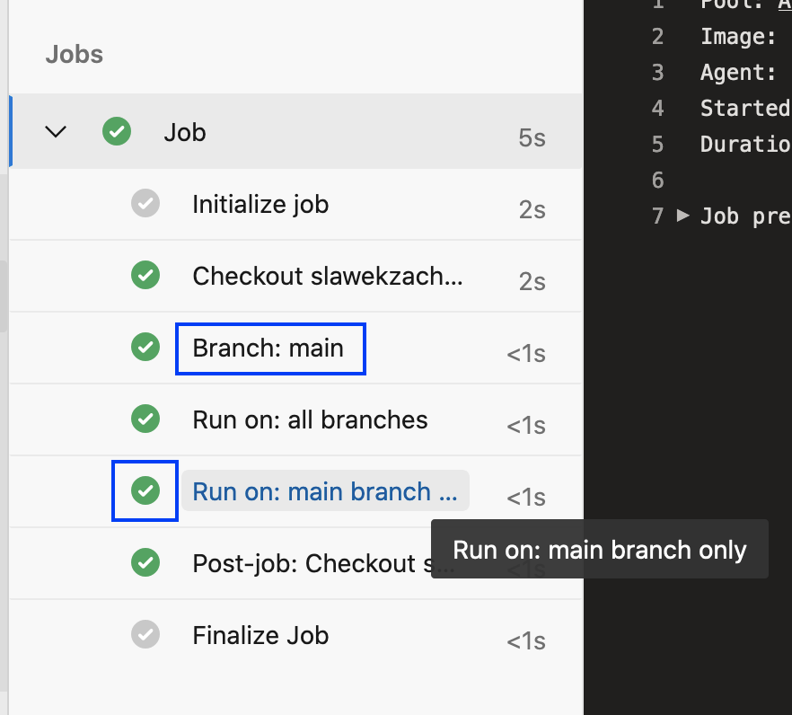

# Azure Pipelines: Conditional Template Task

## Problem

* We have an [Azure Pipelines template](https://docs.microsoft.com/en-us/azure/devops/pipelines/process/templates?view=azure-devops)
  that contains one or more tasks, some of which are executed conditionally,
  based on the value of a template boolean parameter.
* In the pipeline that includes the template we want to execute the conditional
  task only on the `main` branch.

## Solution

* If the boolean parameter name is `runTask`, define in the template 
  the task condition as:
  ```
  condition: and(succeeded(), eq(${{ parameters.runTask }}, true))
  ```
* In the pipeline, use the following template parameter value:
  ```
  parameters:
    runTask: ${{ eq(variables['Build.SourceBranchName'], 'main') }}
  ```

The picture that follows shows the task being executed on the `main` branch:



Below the conditional task was skipped because the pipeline is executed on
`feature1` branch:


## Explanation

Azure Pipelines templates are processed when the pipeline YAML file is assembled
(think: *compile time*) and not all variables' values are available.

The approach to define in the pipeline YAML file a variable and then pass it
as template parameter value does NOT work, e.g.:

```
variables:
  isMain: $[ eq(variables['Build.SourceBranchName'], 'main') ]

steps:
  - template: template.yml
    parameters:
      runTask: $(isMain)
```

The above will result in error similar to:

> The `runTask` parameter value '$(isMain)' is not a valid Boolean.

Because the variable `Build.SourceBranchName` is available when the pipeline
YAML gets assembled, a compile-time expression can be used:
`${{ eq(variables['Build.SourceBranchName'], 'main') }}`.
